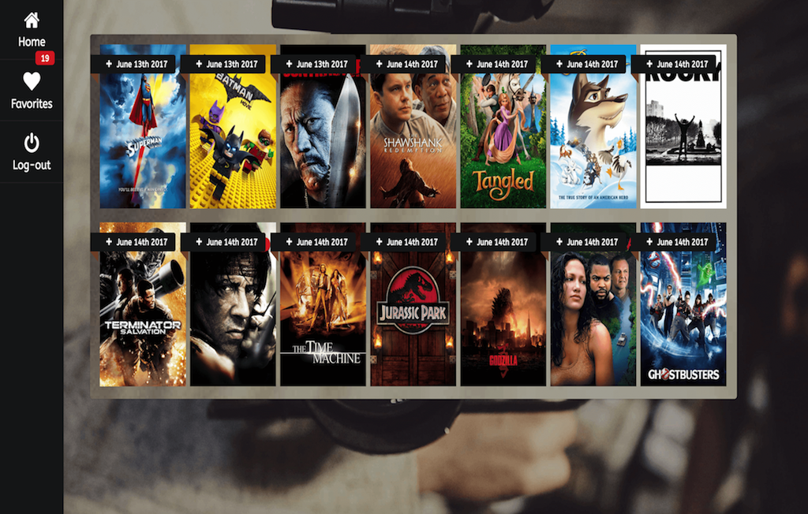

 # Movie Diary
 

### About the App

"Memories make us rich". This web application captures memories of the fun times associated with watching movies in a diary format. 
Using TMDB API, lookup a movie, get details and store as a "memory" card in the app. 

### Features

- Sign-up to be able to use the app
- Search for a movie by name
- Get a list of movies for the search term
- Get details of the movie such as Overview, Genre, Release date, Duration, Cast Details
- Add to favorites if you choose to and add your comments while saving it to the favorites
- Movies can be retrived later, deleted from favorites or comments can be updated. 

### Technology Used

### Front-end
- HTML5, CSS3, Javascript, jQuery, Semantic UI, Sweet Alert
### API 
- TMDB API
### Back-end
- Node.js, Express.js, Passport.js, REST APIs, Mocha, Chai, MongoDB, Mongoose!
